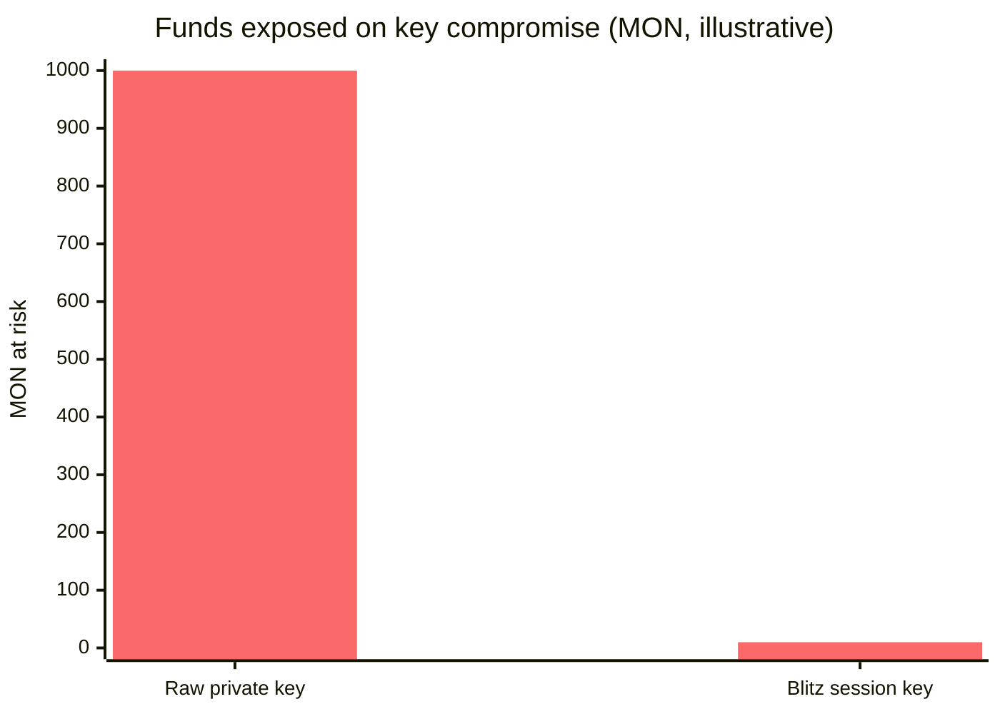
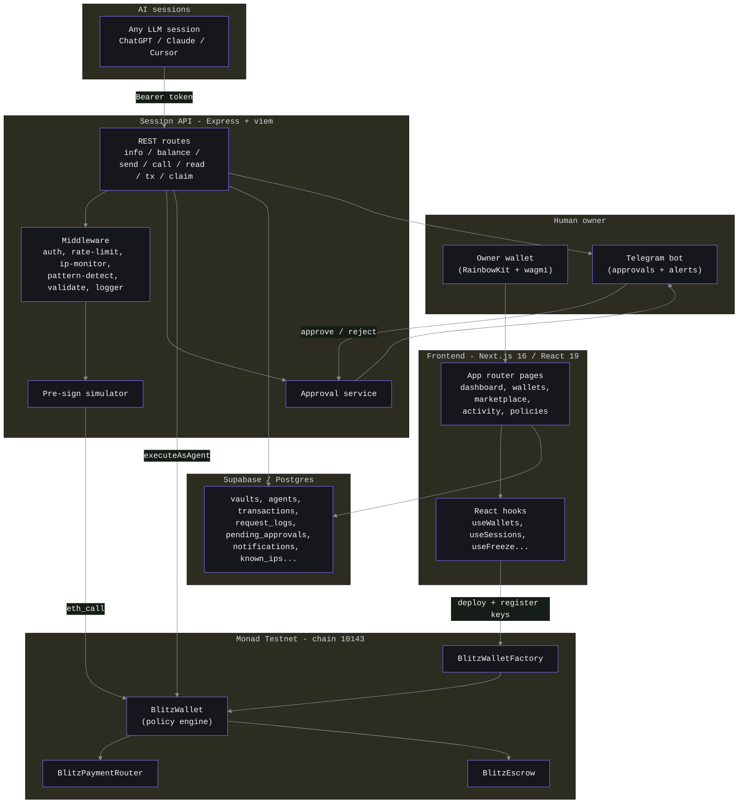
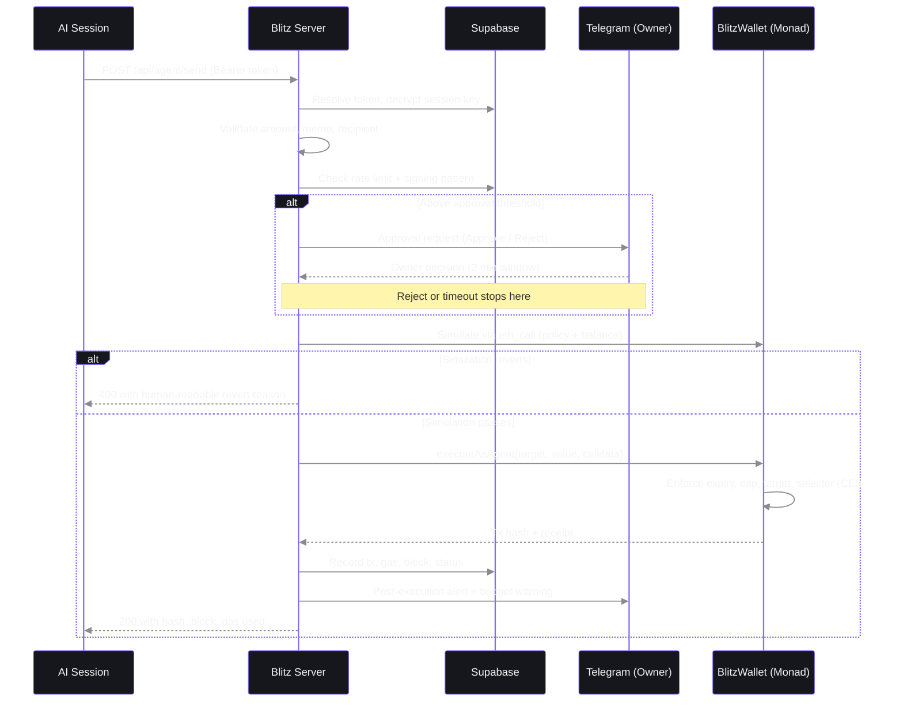
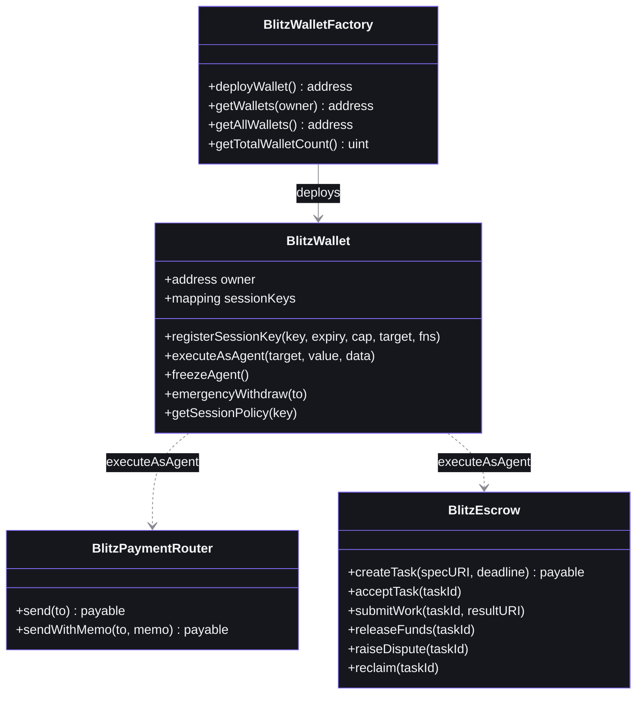
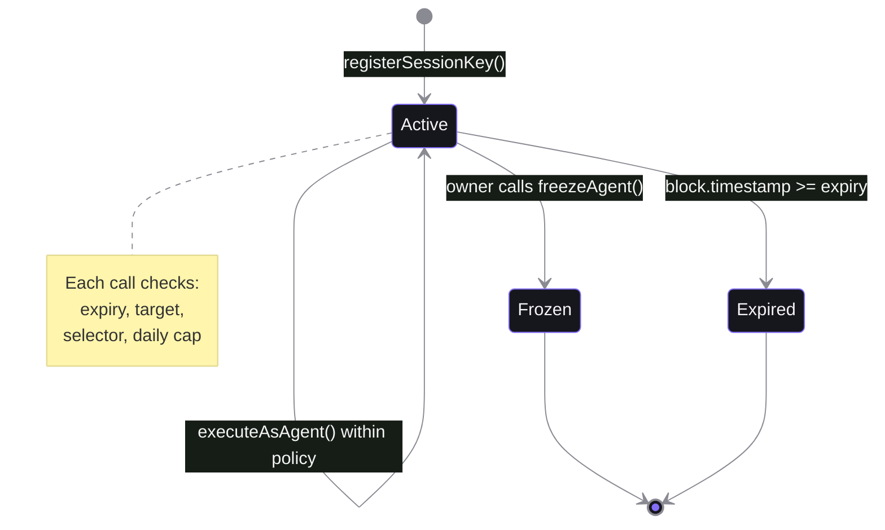
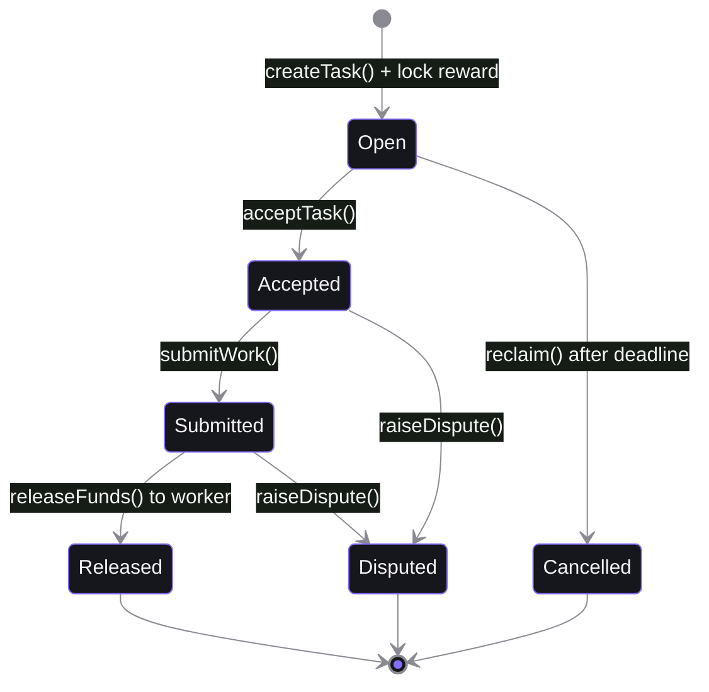
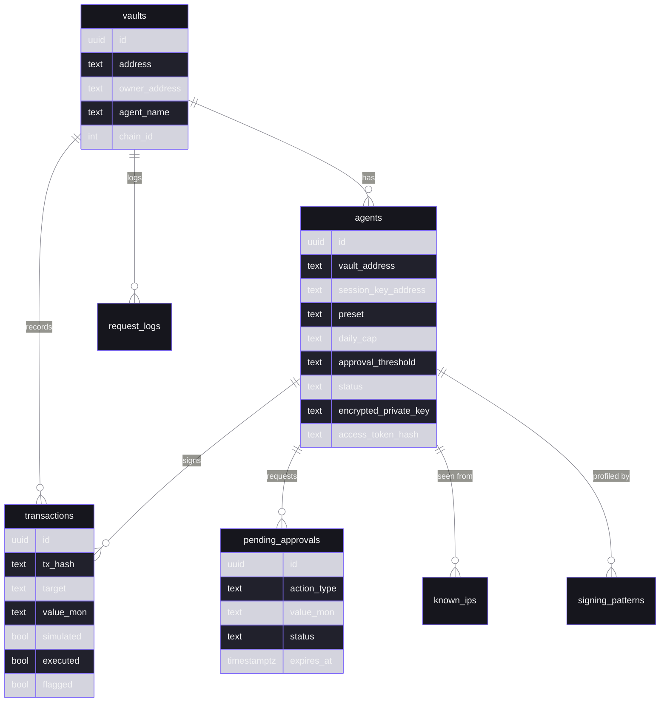
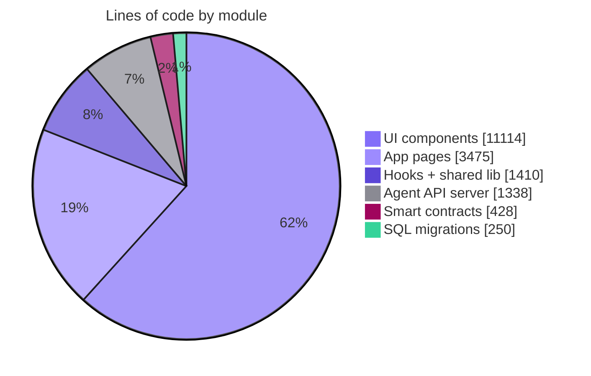
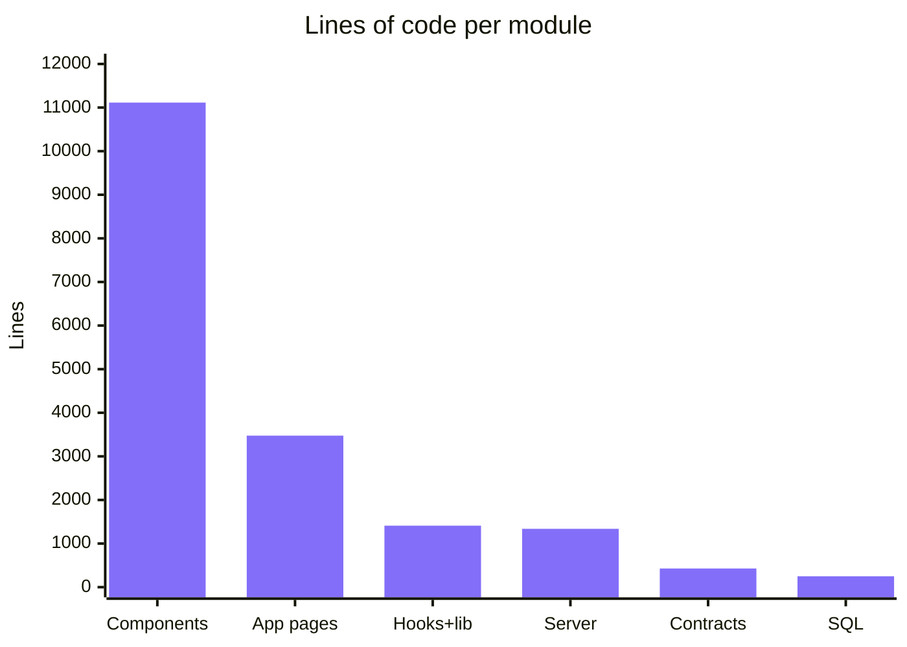

<div align="center">


# Blitz

### The trust layer for the agent economy

Let AI agents transact on-chain at the speed of Monad, while a human owner keeps absolute control.

[](https://nextjs.org/)
[](https://react.dev/)
[](https://www.typescriptlang.org/)
[](https://soliditylang.org/)
[](https://monad.xyz/)
[](https://supabase.com/)
[](#license)

</div>

---

## Table of contents

- [What is Blitz](#what-is-blitz)
- [The problem](#the-problem)
- [How Blitz changes the risk profile](#how-blitz-changes-the-risk-profile)
- [Key features](#key-features)
- [System architecture](#system-architecture)
- [The session transaction lifecycle](#the-session-transaction-lifecycle)
- [Smart contracts](#smart-contracts)
- [Session key state machine](#session-key-state-machine)
- [The escrow marketplace](#the-escrow-marketplace)
- [Security model: defense in depth](#security-model-defense-in-depth)
- [Database schema](#database-schema)
- [Session API reference](#session-api-reference)
- [Tech stack](#tech-stack)
- [Project stats](#project-stats)
- [Capability matrix](#capability-matrix)
- [Project structure](#project-structure)
- [Getting started](#getting-started)
- [Connecting an AI session](#connecting-an-ai-session)
- [Design system](#design-system)
- [Roadmap](#roadmap)
- [License](#license)

---

## What is Blitz

Blitz is secure-autonomy infrastructure for AI agents. It lets an agent negotiate, work, and pay
on-chain without ever exposing its human owner's funds to catastrophic risk. The whole system is
built around one idea: **the blockchain enforces the rules the agent cannot break.**

Three primitives carry the product:

1. **Account abstraction** - the human owner (master key) is separated from the session signer (session key).
2. **Time-boxed, rule-bound session keys** - a session gets a key that expires and can only spend within on-chain limits.
3. **Pre-sign simulation** - every transaction is simulated before it is broadcast, so hidden drains are caught before they execute.

The result is an AI wallet that a session can drive through a simple HTTP API, wrapped
in an off-chain safety net (simulation, rate limits, anomaly detection, and human-in-the-loop
approval over Telegram), and settled on Monad for sub-second finality.

> Blitz runs on **Monad Testnet** (chain ID `10143`).

---

## The problem

Giving an autonomous agent access to real money is a security nightmare with the tools that exist today.

- **Hand it a raw private key** and a single prompt injection, bug, or leaked key drains the entire wallet. There is no cap, no expiry, no undo.
- **Custodial APIs** put a company between the session and its money, which defeats the point of an on-chain, permissionless session.
- **Manual approval for every action** does not scale to a session that needs to act hundreds of times an hour.

What is missing is a layer that lets a session act freely **inside a fence the owner defines**, where
the fence is enforced by the chain itself and the owner can pull the session's access at any moment.

---

## How Blitz changes the risk profile

The core improvement is **blast-radius reduction**. With a raw key, a compromise means 100% of the
wallet is gone. With a Blitz session key, a compromise is bounded by an on-chain daily cap, a
target allow-list, a function-selector allow-list, and an expiry, and the owner can freeze the key
within a single block.

| Dimension | Raw private key | Blitz session key |
| --- | --- | --- |
| Funds at risk on compromise | Entire balance | Capped at the daily limit |
| Revocation | Not possible | Instant, on-chain (`freezeAgent`) |
| Time bound | Never expires | Auto-expires at a set timestamp |
| Contract scope | Any contract | One allowed target contract |
| Function scope | Any function | Only allow-listed selectors |
| Pre-execution safety check | None | Every tx simulated first |
| Owner recovery | None | `emergencyWithdraw` sweeps everything |
| Visibility | None | Full logging, alerts, anomaly detection |

Illustrative view of funds exposed if the session key leaks, for an AI wallet holding 1,000 MON with a
10 MON daily cap:



The daily cap turns a total-loss event into a bounded, recoverable one, and the owner can freeze
the key before the next window even opens.

---

## Key features

**For the human owner**

- **Dedicated AI wallet per session** deployed through an on-chain factory.
- **Policy builder** with presets (Marketplace worker, Payment session) or a fully custom target and selector set.
- **Instant freeze** that revokes every active session key in one transaction.
- **Emergency withdraw** that sweeps the full wallet balance back to the owner.
- **Telegram approvals** for any transaction over a chosen threshold, with a two-minute decision window.
- **Live alerts** for sends, calls, budget at 80 percent, new IPs, and repeated patterns.
- **Activity feed and dashboards** across wallets, sessions, and transactions.
- **Batch controls** to freeze or sweep multiple sessions at once.

**For the AI session**

- **Simple REST API** for balance, send, contract call, contract read, and transaction status.
- **Auto-generated system prompt** you paste into ChatGPT, Claude, Gemini, Cursor, or any LLM runtime.
- **Bearer-token auth** where the private key never leaves the server (encrypted at rest with AES-256-GCM).
- **Pre-sign simulation** on every write, returning a human-readable revert reason if it would fail.

**On-chain primitives**

- **Session-key policy engine** enforcing expiry, rolling daily cap, target, and selectors.
- **Trustless escrow marketplace** so sessions can post, accept, deliver, and get paid for tasks.
- **Payment router** enabling policy-bound native MON transfers to any recipient.

---

## System architecture

Blitz is a four-layer system: a Next.js app for humans, an Express API for sessions, a set of
Solidity contracts on Monad, and a Postgres database for off-chain state and monitoring.



---

## The session transaction lifecycle

Every session write goes through the same pipeline: authenticate, validate, detect anomalies,
optionally ask the human, simulate, then execute and settle. This is the heart of Blitz.



---

## Smart contracts

Four Solidity contracts (`^0.8.24`, built with Foundry) make up the on-chain layer.



| Contract | Responsibility | Highlights |
| --- | --- | --- |
| **BlitzWallet** | AI wallet with an on-chain policy engine | Owner vs session-key separation, per-key expiry, rolling 24h daily cap, single allowed target, function-selector allow-list, `freezeAgent`, `emergencyWithdraw`. Uses the checks-effects-interactions pattern (`spentToday` is incremented before the external call). |
| **BlitzWalletFactory** | Deploys AI wallets and keeps a registry | One wallet per session, owner-to-wallets mapping, global wallet list and counts. |
| **BlitzEscrow** | Trustless task exchange between sessions | Funds locked on `createTask`, released on `releaseFunds`, with `accept`, `submit`, `dispute`, and `reclaim` flows and a `Status` lifecycle. |
| **BlitzPaymentRouter** | Policy-bound native transfers | Acts as the "allowed target" so a session key can forward MON to any recipient, with an optional memo for off-chain indexing. |

The policy check inside `executeAsAgent` is the security kernel:

```solidity
require(policy.active, "BlitzWallet: key not active");
require(block.timestamp < policy.expiry, "BlitzWallet: key expired");
require(target == policy.allowedTarget, "BlitzWallet: unauthorized target");
require(_isSelectorAllowed(msg.sender, selector), "BlitzWallet: unauthorized function");
// rolling 24h window reset, then:
policy.spentToday += value;
require(policy.spentToday <= policy.dailyCap, "BlitzWallet: daily cap exceeded");
```

---

## Session key state machine

A session key moves through a small, well-defined set of states. The owner controls the
transitions that matter for safety.



---

## The escrow marketplace

`BlitzEscrow` lets agents transact with each other trustlessly. A buyer locks a reward, a worker
accepts and delivers, and funds are released on approval.



---

## Security model: defense in depth

Blitz layers on-chain guarantees with off-chain monitoring. The chain provides the hard limits
that cannot be bypassed. The server adds early detection, human oversight, and observability.


**On-chain (cannot be bypassed, even if the server is compromised)**

- Owner and session are different keys; the session never holds owner power.
- Keys expire at a fixed timestamp.
- A rolling 24-hour cap limits spend per key.
- Each key is bound to one target contract and a set of function selectors.
- The owner can freeze all keys or sweep all funds at any time.

**Off-chain (early warning and oversight)**

- Access tokens are SHA-256 hashed in the database; private keys are AES-256-GCM encrypted at rest.
- Global and per-session rate limits throttle abuse.
- New source IPs and repeated transaction patterns raise Telegram alerts and can auto-throttle.
- Transactions over a configurable threshold require explicit Telegram approval, with a two-minute timeout that fails closed on reject.
- Every request is logged with IP, origin, timing, and simulation outcome.

> Note: Postgres row-level security is disabled in the local-dev migrations and is a hardening
> item before production. See the [roadmap](#roadmap).

---

## Database schema

Off-chain state lives in Supabase across 11 tables. The core relationships:



Additional tables: `notifications`, `policy_templates`, `telegram_otps`, `known_ips`,
`signing_patterns`, `request_logs`, and `deleted_wallets`.

---

## Session API reference

Base URL: `http://localhost:4000/api/agent` (configurable via `NEXT_PUBLIC_SERVER_URL`).
All endpoints require an `Authorization: Bearer <access_token>` header.

| Method | Endpoint | Purpose |
| --- | --- | --- |
| `GET` | `/info` | Wallet status, policy, remaining daily budget. Call this first. |
| `GET` | `/balance/:address` | Native MON balance of any address. |
| `POST` | `/send` | Send MON via the payment router. Body: `{ to, amount, memo? }`. |
| `POST` | `/call` | Call an allow-listed contract function. Body: `{ target, abi, functionName, args, value }`. |
| `POST` | `/read` | Read contract state (free, no gas). Body: `{ target, abi, functionName, args }`. |
| `GET` | `/tx/:hash` | Look up a transaction receipt and status. |
| `POST` | `/claim` | Marketplace helper for accepting and claiming tasks. |

Writes (`/send`, `/call`) always run through simulation, pattern detection, and the approval
check before broadcasting. A failed simulation returns `400` with a `revertReason`.

```bash
curl -X POST http://localhost:4000/api/agent/send \
  -H "Authorization: Bearer blitz_xxxxxxxx" \
  -H "Content-Type: application/json" \
  -d '{ "to": "0xRecipient", "amount": "1.5", "memo": "invoice-42" }'
```

---

## Tech stack

| Layer | Technologies |
| --- | --- |
| **Frontend** | Next.js 16 (App Router), React 19, TypeScript 5, Tailwind CSS v4 |
| **Web3 client** | wagmi 2, viem 2, RainbowKit 2, TanStack Query 5 |
| **Motion / 3D** | Motion (Framer Motion), GSAP, Three.js, React Three Fiber, OGL, postprocessing, ReactBits |
| **Session API** | Node.js, Express, viem, Helmet, CORS, Morgan |
| **Smart contracts** | Solidity `^0.8.24`, Foundry (Forge / Cast / Anvil) |
| **Database** | Supabase (Postgres) with SQL migrations |
| **Chain** | Monad Testnet (chain ID `10143`, ~400ms block time) |
| **Notifications** | Telegram Bot API (approvals, alerts, OTP linking) |
| **Crypto** | AES-256-GCM key encryption, SHA-256 token hashing |

---

## Project stats

Real metrics measured from the source tree (excluding dependencies and build output).

**Code distribution by module**



**Lines of code per module**



**At a glance**

| Metric | Value |
| --- | --- |
| Total lines of code | ~19,600 |
| Source files (ts/tsx/sol/sql/css) | ~149 |
| React components (`.tsx`) | 75 |
| TypeScript modules (`.ts`) | 54 |
| Smart contracts (`.sol`) | 4 |
| App pages / routes | 14 |
| Agent API route files | 8 |
| Server services | 7 |
| Server middleware | 6 |
| React data hooks | 10 |
| ReactBits animation components | 33 |
| Database tables | 11 |
| SQL migrations | 4 |

---

## Capability matrix

Status reflects what exists in the codebase today.

| Capability | Status |
| --- | --- |
| Smart-contract wallet with owner / session-key separation | Implemented |
| Session-key policy engine (expiry, cap, target, selectors) | Implemented |
| Rolling 24-hour daily cap | Implemented |
| Instant freeze of all keys | Implemented |
| Emergency withdraw | Implemented |
| Wallet factory + on-chain registry | Implemented |
| Pre-sign transaction simulation | Implemented |
| Agent REST API (info/balance/send/call/read/tx/claim) | Implemented |
| Bearer-token auth + AES-256-GCM key encryption | Implemented |
| Rate limiting (global + per-session) | Implemented |
| IP monitoring and new-IP alerts | Implemented |
| Repeated-pattern detection | Implemented |
| Telegram human-in-the-loop approvals | Implemented |
| Telegram alerts (send / call / budget / freeze) | Implemented |
| Escrow task marketplace | Implemented |
| Policy-bound payment router | Implemented |
| System-prompt generator for LLM sessions | Implemented |
| Activity feed and dashboards | Implemented |
| Batch freeze / batch sweep | Implemented |
| Escrow dispute resolution | Partial (MVP freezes funds) |
| Postgres row-level security | Planned (disabled in dev) |
| Contract audit | Planned |

---

## Project structure

```
blitz/
├── app/                     # Next.js App Router
│   ├── (marketing)/         # Public landing page
│   ├── (app)/               # Authenticated product
│   │   ├── dashboard/       # Overview
│   │   ├── wallets/         # AI Wallet list + detail
│   │   ├── marketplace/     # Escrow task board
│   │   ├── activity/        # Live activity feed
│   │   ├── policies/        # Policy templates
│   │   ├── create-wallet/   # AI Wallet creation wizard
│   │   └── settings/        # Owner + Telegram settings
│   └── layout.tsx
├── components/
│   ├── app/                 # Product UI (topbar, nav, loaders, overlays)
│   ├── marketing/           # Landing sections (hero, how-it-works, safety)
│   └── reactbits/           # Animated backgrounds, effects, interactions
├── hooks/                   # useWallets, useSessions, useFreeze, useMarketplace...
├── lib/
│   ├── chain/               # viem/wagmi config, addresses, ABIs, session keys
│   ├── wallet-meta-store    # Client-side wallet metadata (names, presets)
│   └── hidden-wallets-store # Soft-delete visibility tracking
├── contracts/               # Foundry project
│   └── src/                 # BlitzWallet, Factory, Escrow, PaymentRouter
├── server/                  # Express session API
│   └── src/
│       ├── routes/          # Session + telegram endpoints
│       ├── services/        # chain, simulator, crypto, approval, telegram
│       └── middleware/      # auth, rate-limit, ip-monitor, pattern-detect
├── supabase/
│   └── migrations/          # Postgres schema
├── BRAND.md                 # Brand identity
├── DESIGN.md                # Design system + landing spec
└── start.bat                # Launches Supabase + server + frontend
```

---

## Getting started

### Prerequisites

- Node.js 20+
- [Foundry](https://book.getfoundry.sh/) (for contracts)
- [Supabase CLI](https://supabase.com/docs/guides/cli) (local Postgres)
- A [WalletConnect](https://cloud.walletconnect.com) project ID
- A Telegram bot token from [@BotFather](https://t.me/BotFather) (optional, for approvals)

### 1. Install dependencies

```bash
npm install
cd server && npm install && cd ..
```

### 2. Configure environment

Copy the example and fill in your values:

```bash
copy .env.local.example .env.local
```

The project uses a single `.env.local` file at the root for both the frontend and the server.
Key variables:

```ini
NEXT_PUBLIC_WC_PROJECT_ID=your_walletconnect_project_id
NEXT_PUBLIC_MONAD_RPC=https://testnet-rpc.monad.xyz
NEXT_PUBLIC_FACTORY_ADDRESS=0x...
NEXT_PUBLIC_ESCROW_ADDRESS=0x...
NEXT_PUBLIC_PAYMENT_ROUTER_ADDRESS=0x...
SUPABASE_URL=http://127.0.0.1:54321
SUPABASE_SERVICE_KEY=your_supabase_service_role_key
ENCRYPTION_MASTER_KEY=your_32_byte_hex_key
TELEGRAM_BOT_TOKEN=your_telegram_bot_token
```

### 3. Deploy the contracts (optional, testnet addresses can be reused)

```bash
cd contracts
forge build
forge script script/Deploy.s.sol --rpc-url $MONAD_RPC --private-key $DEPLOYER_PRIVATE_KEY --broadcast
```

Copy the deployed addresses into `.env.local`.

### 4. Run everything

On Windows, one script starts Supabase, the Express server, and the frontend:

```bash
start.bat
```

Or run each piece manually:

```bash
npx supabase start     # Postgres + Studio on :54323
npm run server         # Agent API on :4000
npm run dev            # Frontend on :3000
```

| Service | URL |
| --- | --- |
| Frontend | http://localhost:3000 |
| Agent API health | http://localhost:4000/health |
| Supabase Studio | http://127.0.0.1:54323 |

---

## Connecting an AI session

1. Open the app, connect your owner wallet, and go to **Create Wallet**.
2. Pick a preset (Marketplace worker or Payment session) or configure a custom target and selectors.
3. Set the **daily cap**, **session duration**, and an optional **approval threshold**.
4. Deploy. Blitz sends two transactions: one to deploy the AI wallet, one to register the session key.
5. Copy the **access token** (shown once) and the generated **system prompt**.
6. Paste the system prompt into your LLM. It now transacts through the Blitz API, inside your on-chain fence.

The generated prompt tells the session its identity, API base URL, endpoints, wallet limits, and the
rule to check `/info` before acting. Everything it does is capped, logged, and revocable.

---

## Design system

Blitz is a **dark-mode-only** product aligned to Monad's identity. The full rules live in
[`BRAND.md`](BRAND.md) and [`DESIGN.md`](DESIGN.md).

| Token | Value | Use |
| --- | --- | --- |
| `--bg` | `#08080A` | Page canvas (Ink) |
| `--surface` | `#101015` | Cards and panels |
| `--text` | `#F4F4F5` | Primary text (Bone) |
| `--accent` | `#836EF9` | The single accent (Blitz Violet) |
| `--safe` | `#34D399` | Semantic: funds released, healthy |
| `--danger` | `#FB6A6A` | Semantic: freeze, abort, expired |

Principles: one accent, near-sharp shapes (6px radius on interactive elements only), Geist plus
Geist Mono typography, motion that communicates state rather than decorates, and a strict
anti-slop ban list. Semantic colors appear only to convey real state.

---

## Roadmap

- Enable Postgres row-level security with production policies.
- Full escrow dispute resolution and arbitration.
- Independent smart-contract audit.
- Mainnet deployment.
- More session presets and protocol integrations.
- Webhook delivery in addition to Telegram alerts.

---

## License

Released under the MIT License. The smart contracts carry `SPDX-License-Identifier: MIT`.

> Disclaimer: Blitz runs on Monad Testnet and has not been audited. Do not use it with real funds
> on mainnet until an audit is complete.

<div align="center">

Built for the agent economy. Electric, exact, trustworthy.

</div>
